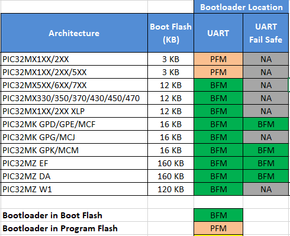
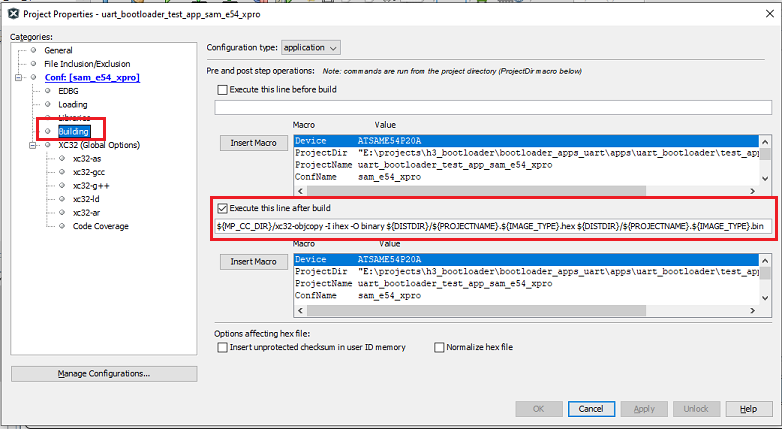

# Configuring an application to be bootloaded for MIPS based MCUs

**Bootloader placement for various PIC32M product families**

The bootloader is placed in **Boot Flash Memory (BFM)** or **Program Flash Memory (PFM)** based on the size of the bootloader and available Boot flash memory on the device.

- If the bootloader fits into the available BFM, it is placed in BFM. The user application can use the complete area of the program Flash memory.

- If the bootloader does not fit into the available BFM, it is placed in PFM. The user application can use the remaining area of the program Flash memory.

- The following table shows the available Boot Flash memory and the placement of different bootloaders by product family. 



**Setting up the Application linker script**

The linker script file of the application project has to be modified to place the vector table and reset handlers in program flash memory.

- For Quick start, Refer to pre developed application linker scripts **app_XX.ld** placed in projects device specific configuration folder of **bootloader_apps_xxx/** repository

- Reset Address for the application to be loaded through bootloader should match the Application start address mentioned in bootloader project.

- The vector address of a given interrupt is calculated using Exception Base (EBASE) CPU register and the _ebase_address should be aligned to 4KB boundary

- **Note: The below sections provides overview of changes required in the applications linker scripts. The address location and size may vary based on the specific device used**

**For Bootloaders placed in Boot Flash Memory (PIC32MZ and PIC32MK Devices)**

- The application start address by default will be start of program flash memory 
    - **Refer to specific device datasheet for program flash memory start address and length**

- The Initial 4KB from Application start address are used by Reset Handler and and cache_init section

- XC32 Compiler calculates offset from the EBASE address and initializes the value of interrupt vector offset (OFFx) register. The offset register is combined with EBASE register using a bitwise OR operator to obtain the interrupt vector address that the CPU will jump to when the corresponding interrupt occurs.

- If the EBASE address is aligned to 4KB, then all the interrupt vectors must be located within the 4KB from base address. 
    - **Example:** When _ebase_address is set to **0x9D001000** and interrupts vectors are not located withing the 4KB boundary from the ebase address **(OFFx > 0x1000)**, then the bitwise OR operator may not provide correct interrupt vector address.

- To provide maximum flexibility in placement of interrupt vectors:
    - Always place the **_ebase_address** at start of Program flash memory **(Example : 0x9D000000)** like the default linker script

    - Change the offsets of exceptions and vector section to place them after the device startup code. With this the interrupt handlers can be located anywhere in the Program Flash memory.

- Updated linker scripts as explained above is shown here **as an example**
    - **Note: Cache related sections are not applicable for PIC32MK Devices**

```c
PROVIDE(_vector_spacing = 0x0001);
PROVIDE(_ebase_address = 0x9D000000);

/* Place the vector table and other exceptions after the device reset and
 * cache init code.
 */
PROVIDE(_ebase_vector_offsets = 0x1000);

_RESET_ADDR                    = 0xBD000000;
_SIMPLE_TLB_REFILL_EXCPT_ADDR  = _ebase_address + _ebase_vector_offsets + 0;
_CACHE_ERR_EXCPT_ADDR          = _ebase_address + _ebase_vector_offsets + 0x100;
_GEN_EXCPT_ADDR                = _ebase_address + _ebase_vector_offsets + 0x180;

kseg0_program_mem  (rx) : ORIGIN = 0x9D001000, LENGTH = 0x200000 - 0x1000

kseg1_boot_mem          : ORIGIN = 0xBD000000, LENGTH = 0x480

kseg1_boot_mem_4B0      : ORIGIN = 0xBD0004B0, LENGTH = 0x1000 - 0x4B0

/* Boot Sections */
.reset _RESET_ADDR :
{
  KEEP(*(.reset))
  KEEP(*(.reset.startup))
} > kseg1_boot_mem

.cache_init :
{
  *(.cache_init)
  *(.cache_init.*)
} > kseg1_boot_mem_4B0
...

/* Interrupt vector table with vector offsets */
.vectors _ebase_address + _ebase_vector_offsets + 0x200 :
{
  /*  Symbol __vector_offset_n points to .vector_n if it exists,
   *  otherwise points to the default handler. The
   *  vector_offset_init.o module then provides a .data section
   *  containing values used to initialize the vector-offset SFRs
   *  in the crt0 startup code.
   */
  . = ALIGN(4) ;
  __vector_offset_0 = (DEFINED(__vector_dispatch_0) ? (. - _ebase_address) : __vector_offset_default);
  KEEP(*(.vector_0))
  ...
  ...
  /* Default interrupt handler */
  . = ALIGN(4) ;
  __vector_offset_default = . - _ebase_address;
  KEEP(*(.vector_default))
} > kseg0_program_mem

```

**For Bootloaders placed in Program Flash Memory (PIC32MK Devices)**

- The bootloader code resides from start of Program flash memory, hence the application start address has to be after the end of bootloader.
    - **Refer to specific device datasheet for program flash memory start address and length**

- The Initial 4KB from Application start address are used by Reset Handler section

- XC32 Compiler calculates offset from the EBASE address and initializes the value of interrupt vector offset (OFFx) register. The offset register is combined with EBASE register using a bitwise OR operator to obtain the interrupt vector address that the CPU will jump to when the corresponding interrupt occurs.

- If the EBASE address is aligned to 4KB, then all the interrupt vectors must be located within the 4KB from base address. 
    - **Example:** When _ebase_address is set to **0x9D001000** and interrupts vectors are not located withing the 4KB boundary from the ebase address **(OFFx > 0x1000)**, then the bitwise OR operator may not provide correct interrupt vector address.

- To provide maximum flexibility in placement of interrupt vectors:
    - Always place the **_ebase_address** at start of Program flash memory **(Example : 0x9D000000)** like the default linker script

    - **Note: As _ebase_address is only used to calculate the vector offset it can be placed at start of program flash memory even though the bootloader code is residing there** 

    - Change the offsets of exceptions and vector section to place them **after the device startup code of application**. With this the interrupt handlers can be located anywhere in the Program Flash memory after bootloader space

- Updated linked scripts as explained above is shown here **as an example**.
    - Bootloader length **\<bootloader_length\>** in the below snippet needs to be replaced with size of the respective bootloader.

```c
PROVIDE(_vector_spacing = 0x0001);
PROVIDE(_ebase_address = 0x9D000000);

/* Place the vector table and other exceptions after the device reset and
 * cache init code.
 */
PROVIDE(_ebase_vector_offsets = <bootloader_length> + 0x1000);

_RESET_ADDR                    = 0xBD000000 + <bootloader_length>;
_SIMPLE_TLB_REFILL_EXCPT_ADDR  = _ebase_address + _ebase_vector_offsets + 0;
_GEN_EXCPT_ADDR                = _ebase_address + _ebase_vector_offsets + 0x180;

kseg0_program_mem  (rx) : ORIGIN = 0x9D000000 + <bootloader_length> + 0x1000, LENGTH = 0x200000 - <bootloader_length> - 0x1000

kseg1_boot_mem          : ORIGIN = 0xBD000000 + <bootloader_length>, LENGTH = 0x1000

/* Boot Sections */
.reset _RESET_ADDR :
{
  KEEP(*(.reset))
  KEEP(*(.reset.startup))
} > kseg1_boot_mem

...

/* Interrupt vector table with vector offsets */
.vectors _ebase_address + _ebase_vector_offsets + 0x200 :
{
  /*  Symbol __vector_offset_n points to .vector_n if it exists,
   *  otherwise points to the default handler. The
   *  vector_offset_init.o module then provides a .data section
   *  containing values used to initialize the vector-offset SFRs
   *  in the crt0 startup code.
   */
  . = ALIGN(4) ;
  __vector_offset_0 = (DEFINED(__vector_dispatch_0) ? (. - _ebase_address) : __vector_offset_default);
  KEEP(*(.vector_0))
  ...
  ...
  /* Default interrupt handler */
  . = ALIGN(4) ;
  __vector_offset_default = . - _ebase_address;
  KEEP(*(.vector_default))
} > kseg0_program_mem

```

**For Bootloaders placed in Boot Flash Memory (PIC32MX Devices)**

- The application start address by default will be start of program flash memory
    - **Refer to specific device datasheet for program flash memory start address and length**

- The Initial 4KB are used by Reset Handler section

- In PIC32MX devices the _ebase_address holds the start address of vector table and it must be placed at 4KB boundary after the Reset Handler section

- Updated linked scripts as explained above is shown here **as an example.**

```c
PROVIDE(_vector_spacing = 0x0001);
PROVIDE(_ebase_address = 0x9D001000);

_RESET_ADDR                 = 0xBD000000

kseg0_program_mem     (rx)  : ORIGIN = 0x9D001000, LENGTH = 0x80000 - 0x1000
kseg1_boot_mem              : ORIGIN = 0xBD000000, LENGTH = 0x1000

/* Boot Sections */
.reset _RESET_ADDR :
{
  KEEP(*(.reset))
  KEEP(*(.reset.startup))
} > kseg1_boot_mem
...

.vector_0 _ebase_address + 0x200 + ((_vector_spacing << 5) * 0) :
{
   KEEP(*(.vector_0))
} > kseg0_program_mem
ASSERT (_vector_spacing == 0 || SIZEOF(.vector_0) <= (_vector_spacing << 5), "function at exception vector 0 too large")

.vector_1 _ebase_address + 0x200 + ((_vector_spacing << 5) * 1) :
{
   KEEP(*(.vector_1))
} > kseg0_program_mem
ASSERT (_vector_spacing == 0 || SIZEOF(.vector_1) <= (_vector_spacing << 5), "function at exception vector 1 too large")
...
...

```

**For Bootloaders placed in Program Flash Memory (PIC32MX Devices)**

- The bootloader code resides from start of Program flash memory, hence the application start address has to be after the end of bootloader.

- The Initial 4KB from Application start address are used by Reset Handler section

- Place the _ebase_address **after the device startup code of application**

- Updated linked scripts as explained above is shown here **as an example.**
    - Bootloader length **\<bootloader_length\>** in the below snippet needs to be replaced with size of the respective bootloader.

```c
PROVIDE(_vector_spacing = 0x0001);
PROVIDE(_ebase_address = 0x9D000000 + <bootloader_length> + 0x1000);

_RESET_ADDR                 = 0xBD000000 + <bootloader_length>;

kseg0_program_mem     (rx)  : ORIGIN = 0x9D000000 + <bootloader_length> + 0x1000, LENGTH = 0x80000 - <bootloader_length> - 0x1000
kseg1_boot_mem              : ORIGIN = 0xBD000000 + <bootloader_length>, LENGTH = 0x1000

/* Boot Sections */
.reset _RESET_ADDR :
{
  KEEP(*(.reset))
  KEEP(*(.reset.startup))
} > kseg1_boot_mem
...

.vector_0 _ebase_address + 0x200 + ((_vector_spacing << 5) * 0) :
{
   KEEP(*(.vector_0))
} > kseg0_program_mem
ASSERT (_vector_spacing == 0 || SIZEOF(.vector_0) <= (_vector_spacing << 5), "function at exception vector 0 too large")

.vector_1 _ebase_address + 0x200 + ((_vector_spacing << 5) * 1) :
{
   KEEP(*(.vector_1))
} > kseg0_program_mem
ASSERT (_vector_spacing == 0 || SIZEOF(.vector_1) <= (_vector_spacing << 5), "function at exception vector 1 too large")
...
...

```

**Note**

- The bootloader and the application must have the same device configuration bit settings. The Device configuration bit settings from the bootloader project will be updated by the programmer/debugger, Hence the application linker script should not have any device configuration bit settings. The application project will use the device configuration bit settings done by bootloader.
- Device configurations and debug exception need to discarded from final hex file for the application project.

    ```c
    /DISCARD/ : { *(._debug_exception) }
    /DISCARD/ : { *(.config_*) }
    ```

**Additional settings (Optional)**

**Data Memory Origin** and **Data Memory Length** values should be updated in linkerscript for reserving configured bytes from start of RAM to **trigger bootloader from firmware**

```c
/* Reserve <trigger_len> Bytes to Store Bootloader Trigger Pattern */
kseg0_data_mem       (w!x)  : ORIGIN = <ram_start> + <trigger_len>, LENGTH = <ram_length> - <trigger_len>
```

**MPLAB X Settings**

Specifying post build option to automatically generate the binary file from hex file once the build is complete

    ```
    ${MP_CC_DIR}/xc32-objcopy -I ihex -O binary ${DISTDIR}/${PROJECTNAME}.${IMAGE_TYPE}.hex ${DISTDIR}/${PROJECTNAME}.${IMAGE_TYPE}.bin
    ```



