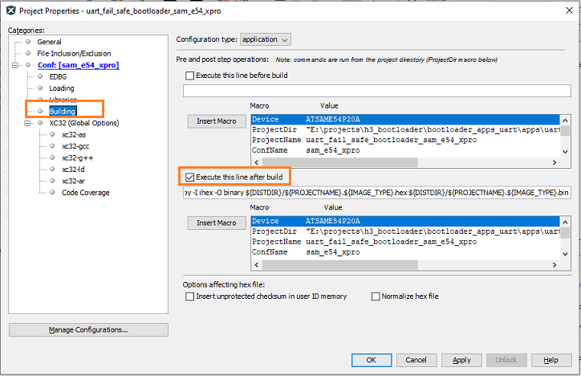

# SAM E54 Xplained Pro Evaluation Kit: Building and Running the UART Fail Safe Bootloader applications

**Downloading and building the application**

To clone or download this application from Github,go to the [main page of this repository](https://github.com/Microchip-MPLAB-Harmony/bootloader_apps_uart) and then click Clone button to clone this repo or download as zip file. This content can also be download using content manager by following [these instructions](https://github.com/Microchip-MPLAB-Harmony/contentmanager/wiki)

Path of the application within the repository is **apps/uart_fail_safe_bootloader/**

To build the application, refer to the following table and open the project using its IDE.

**Bootloader Application**

| Project Name      | Description                                    |
| ----------------- | ---------------------------------------------- |
| bootloader/firmware/sam_e54_xpro.X    | MPLABX Project for [SAM E54 Xplained Pro Evaluation Kit](https://www.microchip.com/developmenttools/ProductDetails/atsame54-xpro)|

**Test Application**

| Project Name      | Description                                    |
| ----------------- | ---------------------------------------------- |
| test_app/firmware/sam_e54_xpro.X    | MPLABX Project for [SAM E54 Xplained Pro Evaluation Kit](https://www.microchip.com/developmenttools/ProductDetails/atsame54-xpro)|

**Setting up [SAM E54 Xplained Pro Evaluation Kit](https://www.microchip.com/developmenttools/ProductDetails/atsame54-xpro)**

- Connect the Debug USB port on the board to the computer using a micro USB cable

**Setting up the host script**

- Refer to [Bootloader Host Script Help](GUID-E9768065-2540-409B-AC12-3DA9417F01F5.md) for setting up the **btl_host.py** utility used to send the application binary from host PC

- Refer to [Bootloader App Merge Bin Help](GUID-4C0F39DE-6971-4A2F-B33A-E203BA5A9119.md) for setting up the **btl_app_merge_bin.py** utility used to merge the bootloader binary and application binary

    

**Running the Application**

1. Open the test application project *test_app/firmware/sam_e54_xpro.X* in the IDE
2. Build the project to generate the binary **(Do not program the binary)**
3. Open the bootloader project *bootloader/firmware/sam_e54_xpro.X* in the IDE
4. Build and program the application using the IDE

5. Launch MHC for the *bootloader/firmware/sam_e54_xpro.X* project
    - Disable Fuse Settings

        

    - Regenerate the project

    - Enable **Execute this line After Build** option in MPLAB X Project properties->Building option

        

6. Build the project to generate the bootloader binary **(Do not program the binary)**

7. Run the **btl_app_merge_bin.py** from command prompt to merge the generated Bootloader binary and test application binary. Below output should be displayed on command prompt

        python <harmony3_path>/bootloader/tools/btl_app_merge_bin.py -o 0x2000 -b <harmony3_path>/bootloader_apps_uart/apps/uart_fail_safe_bootloader/bootloader/firmware/sam_e54_xpro.X/dist/sam_e54_xpro/production/sam_e54_xpro.X.production.bin -a <harmony3_path>/bootloader_apps_uart/apps/uart_fail_safe_bootloader/test_app/firmware/sam_e54_xpro.X/dist/sam_e54_xpro/production/sam_e54_xpro.X.production.bin

    

8. Run the **btl_host.py** from command prompt to program the merged binary to opposite panel. **btl_app_merged.bin** will be created in the current directory from where the **btl_app_merge_bin.py** was called

        python <harmony3_path>/bootloader/tools/btl_host.py -v -s -i <COM PORT> -d same5x -a 0x80000 -f <Path_To_Merged_Binary>/btl_app_merged.bin

9. Following snapshot shows example output of successfully programming the merged binary
    - **Swapping Bank And Rebooting** and **Reboot Done** messages in below output signifies that bootloading is successful

    

10. If above step is successful then the **LED0** should start blinking
11. Open the Terminal application (Ex.:Tera Term) on the computer
12. Configure the serial port settings as follows:
    - Baud : 115200
    - Data : 8 Bits
    - Parity : None
    - Stop : 1 Bit
    - Flow Control : None

13. Reset or Power cycle the device
14. **LED0** should start blinking and you should see below output on the console
    - The NVM Flash Bank Can be **BANK A** or **BANK B** based on from where the test application is running

    

    

15. Press and hold the Switch **SW0** to trigger Bootloader from test application to program firmware in other bank and you should see below output

    

16. Disconnect UART console
17. Run the **btl_host.py** from command prompt to program only the test application binary to opposite panel

        python <harmony3_path>/bootloader/tools/btl_host.py -v -s -i <COM PORT> -d same5x -a 0x82000 -f <harmony3_path>/bootloader_apps_uart/apps/uart_fail_safe_bootloader/test_app/firmware/sam_e54_xpro.X/dist/sam_e54_xpro/production/sam_e54_xpro.X.production.bin

18. Repeat Steps 9-14 once
    - This step is to verify that bootloader is running after triggering bootloader from test application in Step 15
    - Also to program the new firmware in opposite bank
    - You should see other Bank in console displayed compared to first run

**Note:**

If demo needs to be restarted from beginning
- Revert the changes done in Step 5
- Regenerate the project
- Start from Step 4

**Additional Steps (Optional)**

- To bootload any other application refer to [Configuring an application to be bootloaded for CORTEX-M based MCUs](GUID-CC123855-6D3C-458D-8A42-C73711B21E4F.md)
